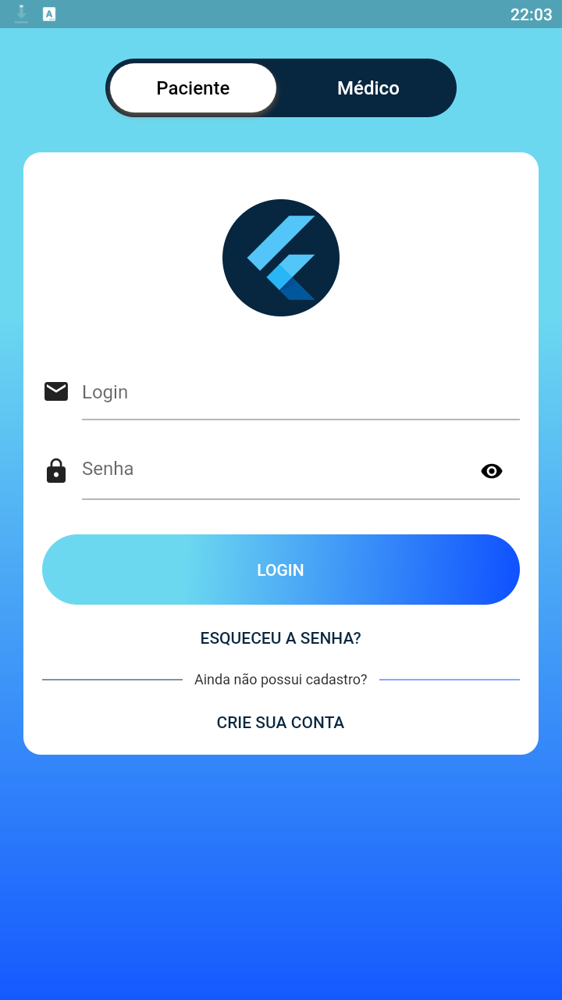
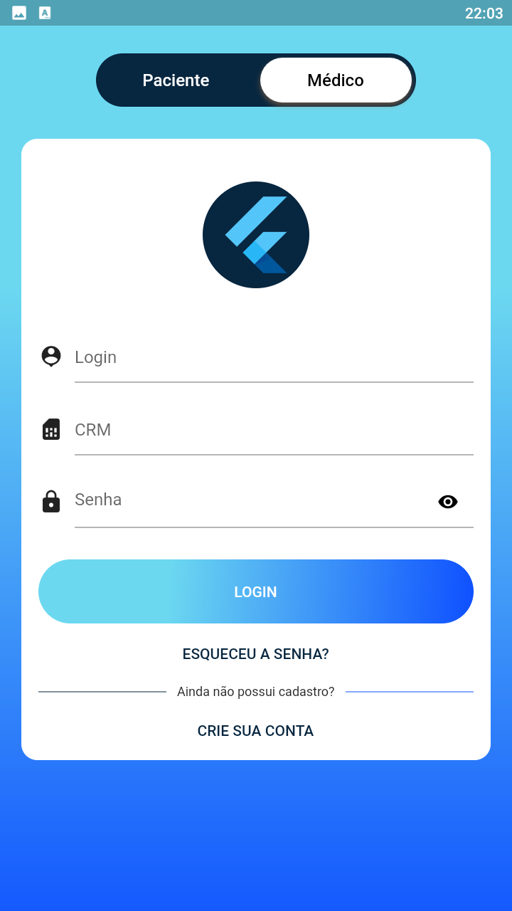
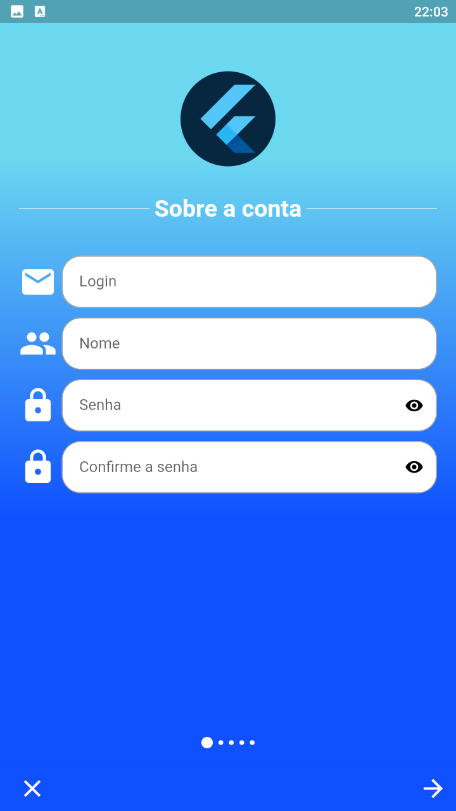
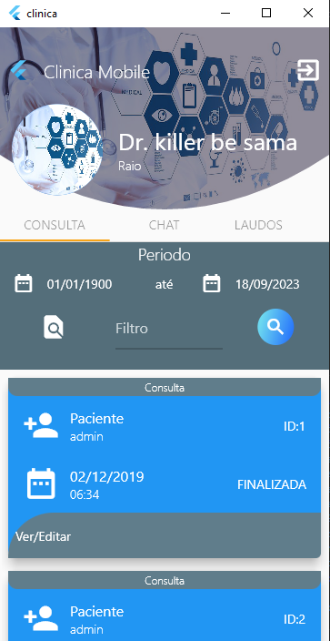
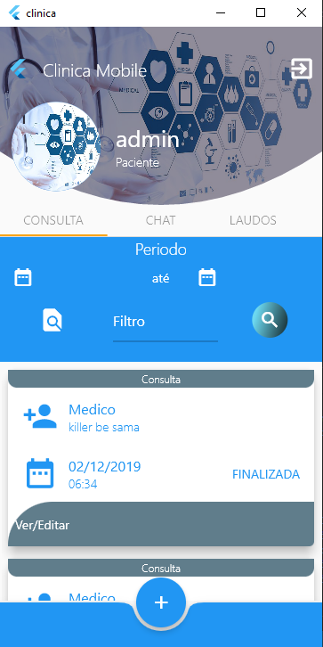
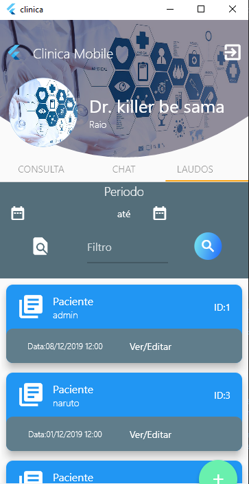

# MOBILE CLÍNICA 

Mobile Clínica é um aplicativo desenvolvido pelos discentes Paulo Alves da Silva e Felipe Antônio Alves Leite para obtenção de nota no Projeto da disciplina de dispositivos móveis, 2019.2 na UNIDADE ACADÊMICA DE SERRA TALHADA. 

## Autores 👨‍💻👨‍🏫

- Paulo Alves da Silva
- Felipe Antonio Alves Leite

## Ano 📅

2019

## Descrição do Projeto 
Mobile Clínica é um aplicativo que permite o gerenciamento de forma ampla de uma clínica. Resumidamente, o app permite duas vias de acesso. É possível entrar no aplicativo como paciente ou médico. Os pacientes podem, dentre outras coisas, verificar a disponibilidade de profissionais e agendar consultas. Os médicos, por sua vez, verificam a agenda diária de pacientes e registram seu laudo.

### Capturas de tela 📸

#### Login Paciente

#### Login Médico

#### Cadastro

#### Home Page Médico

#### Home Page Paciente

#### Laudo

## Tecnologias Utilizadas

-  Flutter
-  Dart
-  Django
-  Python

## Universidade 🎓

Unidade Acadêmica de Serra Talhada/Universidade Federal Rural de Pernambuco (UAST-UFRPE)

